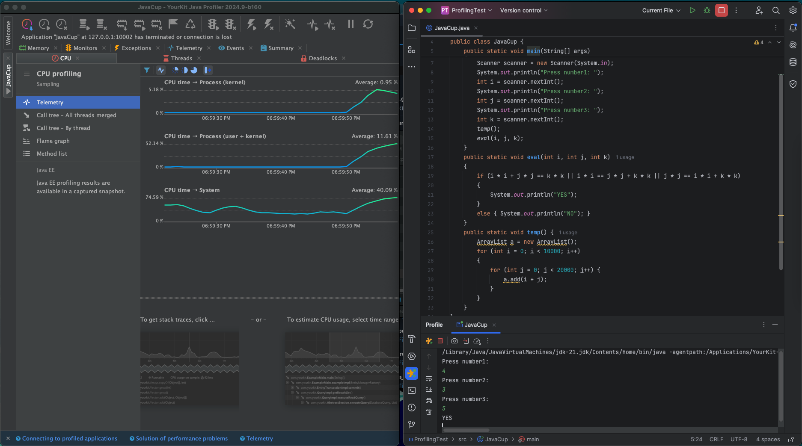
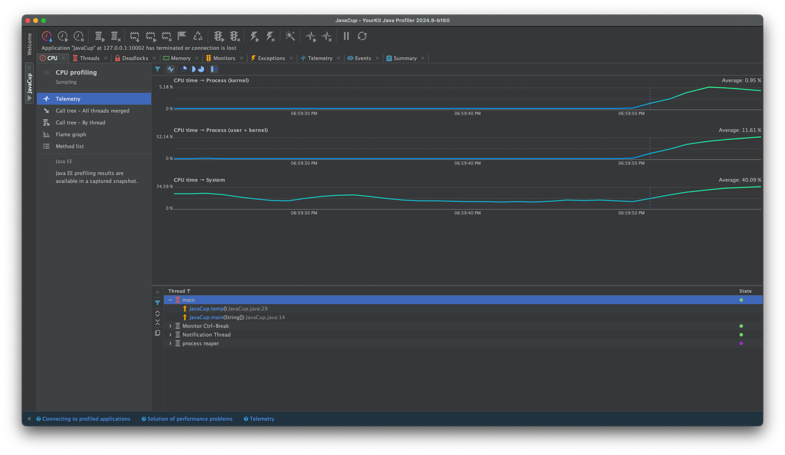
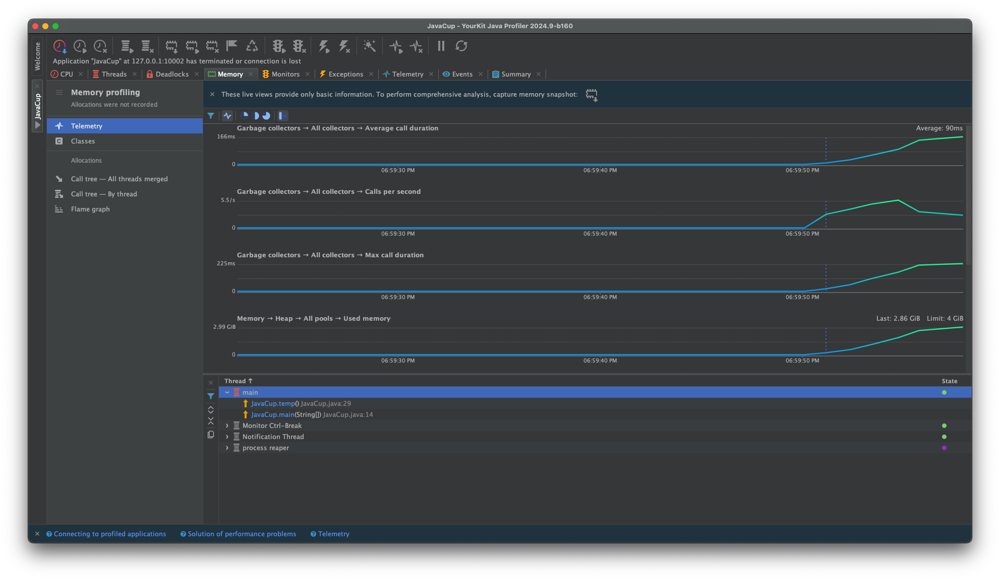
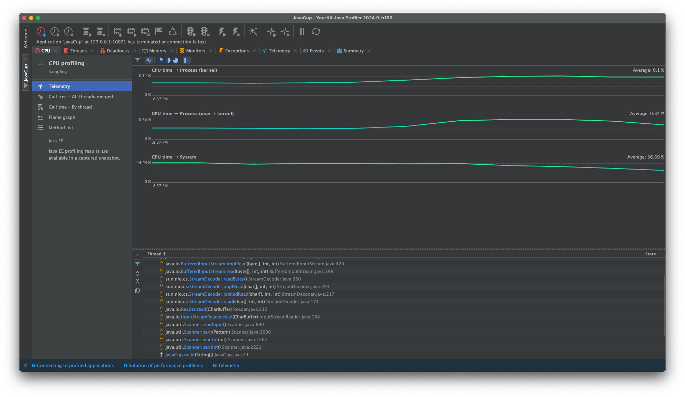
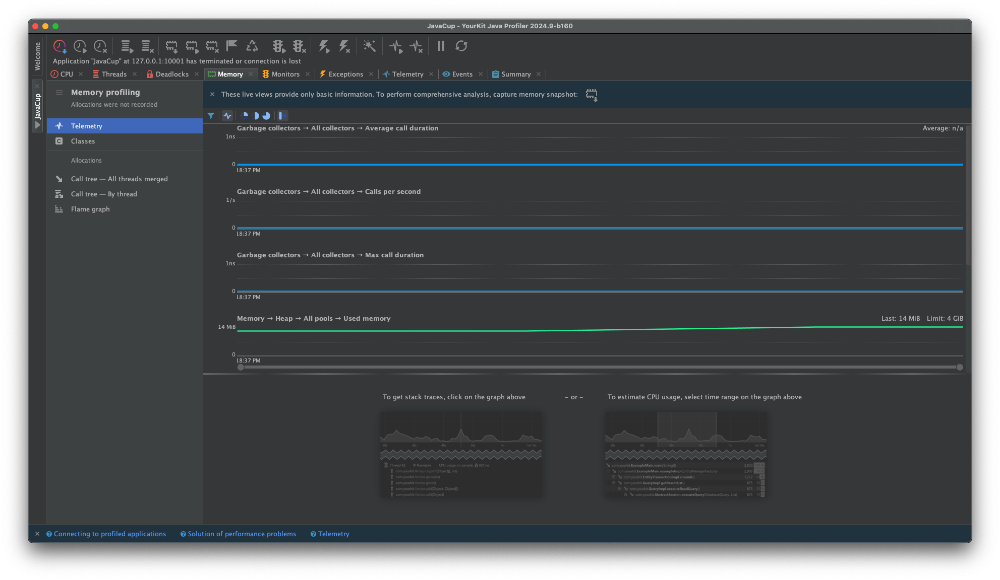
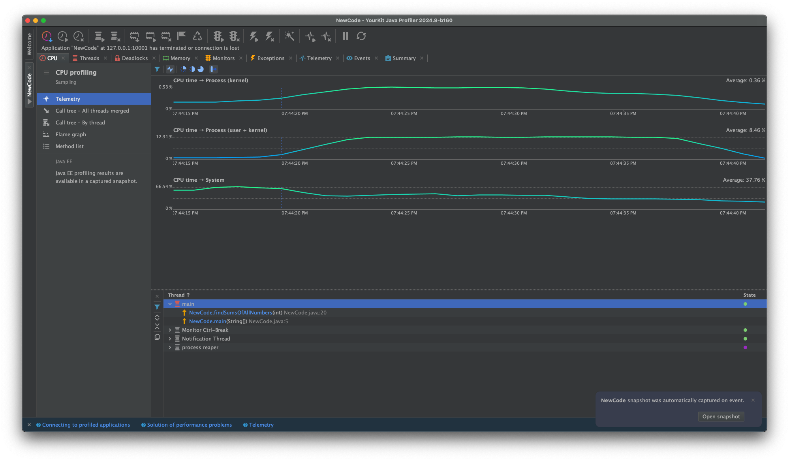
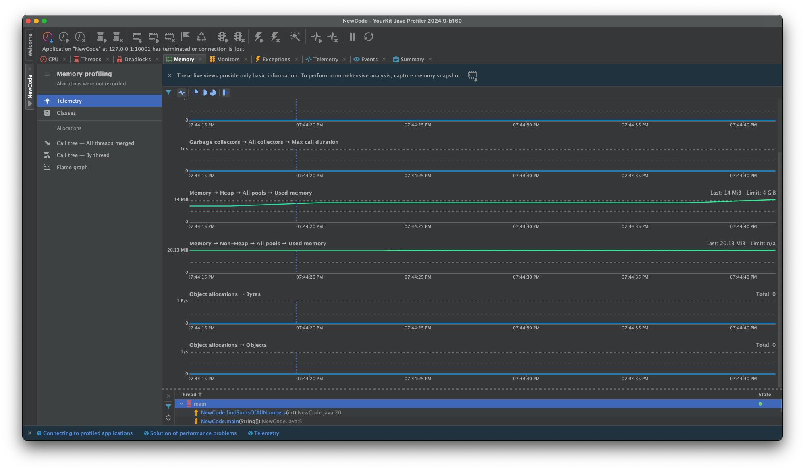
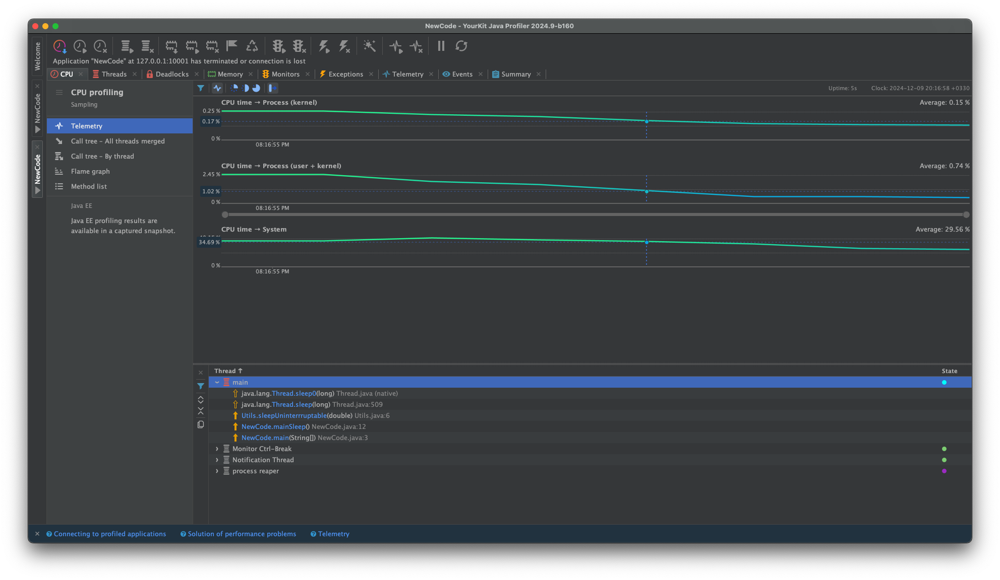
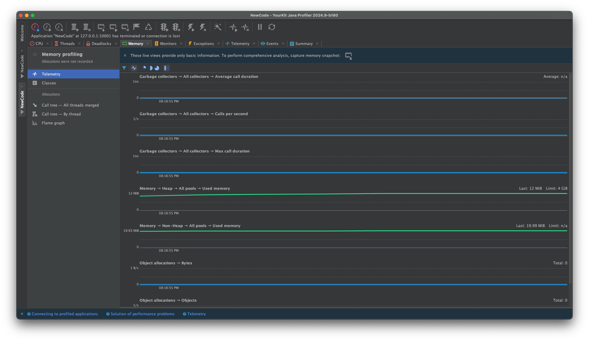

# آزمایش ۵ - پروفایلینگ

## بررسی JavaCup

در ابتدا برنامه‌ی YourKit را از سایت گفته شده برای سیستم‌عامل مک دانلود کردیم و پس از راه‌اندازی. پلاگین YourKit بر روی Intellij آیکون مربوط به این برنامه در Intellij ظاهر شد.

پس از اجرای برنامه JavaCup با استفاده از دکمه YourKit در Intellij برنامه به شکل زیر شد و ورودی‌‌ها را به آن دادیم.

با بررسی برنامه‌ی زمانی YourKit می‌بینیم که تا زمانی که نمودار CPU یکنواخت بود، درحال گرفتن ووردی‌‌ها بودیم و پس از آن تابع temp است که مصرف CPU بالایی دارد. 

بررسی مصرف حافظه RAM نیز همین نتیجه را به ما نشان میدهد.


## بهبود JavaCup
همانطور که در قسمت قبل هم دیدیم، تابع temp مصرف CPU و RAM بالایی دارد که این موضوع به استفاده از ArrayList و append کردن اعداد بستگی دارد که عملیات سنگینی است. برای بهبود این کد میتوان ArrayList را به صورت زیر با آرایه جایگزین کرد.
```
public static void temp() {
    int [][] a = new int[10000][20000];
    for (int i = 0; i < 10000; i++) {
        for (int j = 0; j < 20000; j++) {
            a[i][j] = i + j;
        }
    }
}
```
پس از اعمال این تغییر، دیگر peak خاصی در نمودارهای CPU و RAM نخواهیم داشت و. حتی این تابع به قدری سریع و کم‌مصرف شده است که در نمودار‌ها قابل مشاهده نیست.



## کد خودمان
ما در این قسمت یک کلاس NewCode ساختیم که دارای یک تابع به نام 
findSumsOfAllNumbers
است که این تابع یک عدد n میگیرد و به ازای عدد ۱ تا n مجموع اعداد ۱ تا آن عدد را محاسبه میکند. ایراد کد ما دو مرتبه است:
- ما به جای استفاده از Dynamic Programming و استفاده از نتایج مراحل قبل هر بار حاصل جمع را از اول محاسبه کردیم.
- حتی میتوانستیم بجای محاسبه حاصل جمع‌ ها با استفاده از for loop، از رابطه‌ی 
$1+2+...+i = \frac{i (i+1)}{2}$
استفاده کنیم.

کد این تابع در حالت اولیه بصورت زیر است که بررسی آن در YourKit نیز نشان میدهد که این تابع مصرف CPU بالایی دارد اما مصرف RAM بالایی ندارد. و حین اجرای تابع تنها در حد چند مگابایت مقدار مصرف RAM تغییر میکند.
```
private static void findSumsOfAllNumbers(int n) {
    int[] arr = new int[n];
    for (int i = 1; i <= n; i++) {
        arr[i - 1] = 0;
        for (int j = 1; j <= i; j++)
            arr[i - 1] += j;
    }
}
```



حال با به‌کارگیری Dynamic Programming سعی میکنیم تا مصرف CPU این برنامه را کاهش دهیم.
```
private static void findSumsOfAllNumbersImproved(int n) {
    int[] arr = new int[n];
    for (int i = 1; i <= n; i++) {
        arr[i - 1] = (i == 1) ? 1 : (arr[i - 2] + i);
    }
}
```
با این کار برنامه را از Order فاکتوریلی به خطی رساندیم و نتایج در YourKit به صورت زیر خواهند شد.


